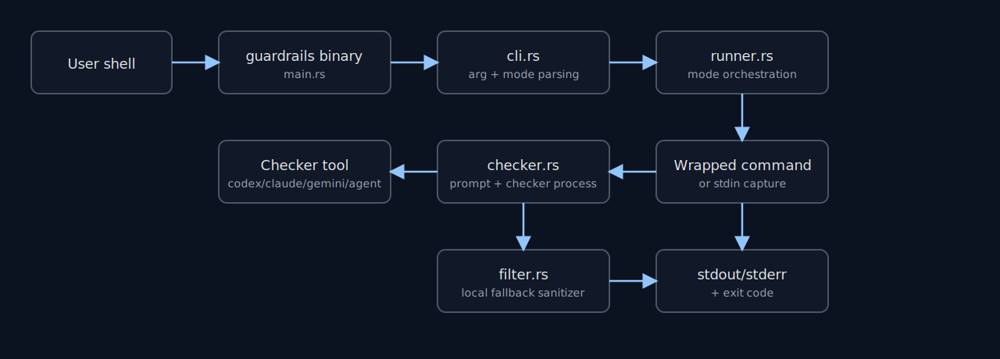
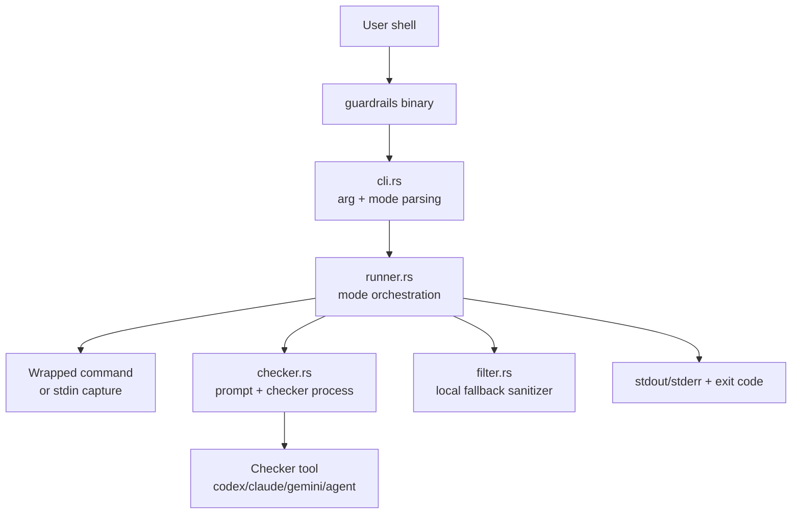
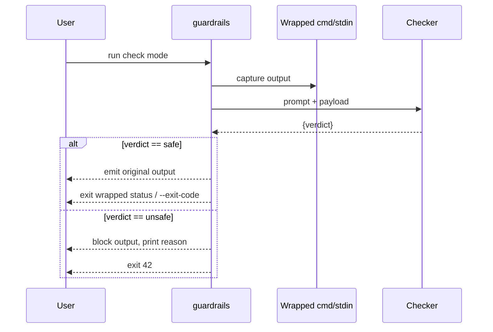
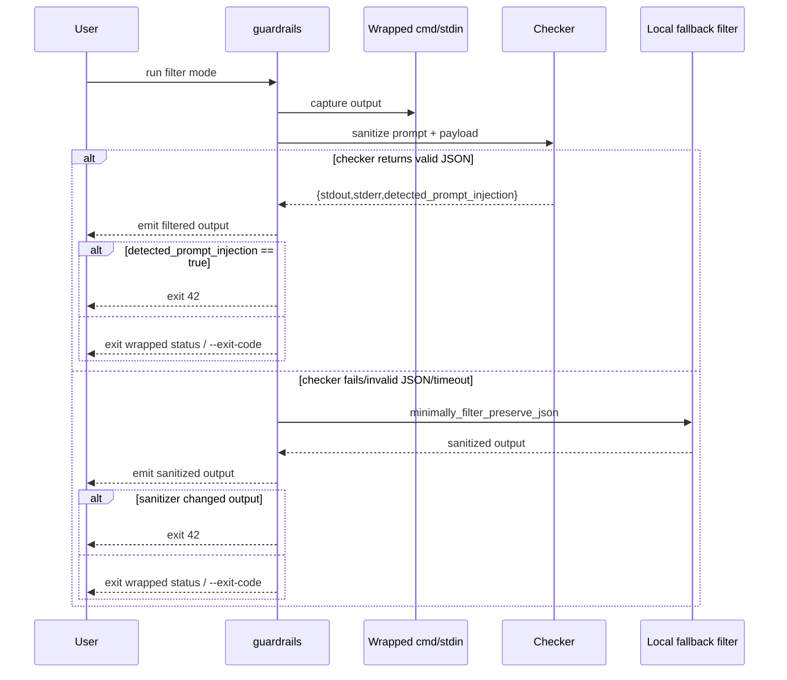

# guardrails Architecture

This document explains how `guardrails` works internally.

## 1) What guardrails is

`guardrails` is a Rust CLI wrapper around another command (or around piped stdin).

It has two operating modes:

- `check` mode (default): detect prompt-injection patterns and block unsafe output.
- `filter` mode (`guardrails filter ...`): sanitize output and pass the sanitized output through.

At a high level:

1. Capture output (or read stdin).
2. Build a JSON payload describing that output.
3. Send that payload to a checker CLI (Codex/Claude/Gemini/Agent).
4. Enforce policy based on checker response (or fallback local sanitizer).

## 2) Module map

- `src/main.rs`: mode parse, Clap parse, top-level validation, handoff to runner.
- `src/cli.rs`: CLI options, checker enum, mode detection (`filter` subcommand handling).
- `src/runner.rs`: orchestration for wrapped-command flow and stdin flow.
- `src/checker.rs`: checker invocation, prompt building, JSON response parsing.
- `src/filter.rs`: local minimal sanitizer and output-clamping helper.

Component diagram:

Static fallback image:





## 3) Mode selection and argument parsing

Mode selection is intentionally simple:

- If argv position 1 is literal `filter`, mode is `Filter`.
- Otherwise mode is `Check`.

After selecting mode, `filter` is removed from argv and Clap parses the same `Cli` struct for both modes.

Important validation:

- `--pty` requires a wrapped command (validated in `main`).
- In `check` mode, `--checker-context` is rejected with exit code `2`.

## 4) Execution paths

There are two input paths for each mode:

- Wrapped command path (`command` is present)
- Stdin path (`command` absent, read from stdin)

Matrix:

| Mode | Input path | Core behavior |
|---|---|---|
| check | wrapped command | checker returns `safe/unsafe`; unsafe blocks output |
| check | stdin | checker returns `safe/unsafe`; safe re-emits stdin |
| filter | wrapped command | checker returns rewritten stdout/stderr |
| filter | stdin | checker returns rewritten stdout |

## 5) Wrapped command flow

When a wrapped command is provided:

1. Execute wrapped program.
2. Capture output bytes (`stdout`, `stderr`) in memory.
3. Build checker payload (`CheckRequest`).
4. Invoke checker prompt.
5. Apply mode-specific decision logic.

`--pty` behavior on Unix:

- wrapped process runs under PTY (`openpty`).
- output streams are merged into `stdout` capture (no separate `stderr` stream).
- useful for preserving TTY formatting/column output.

## 6) Stdin flow

When no wrapped command is provided:

1. If stdin is TTY, error and exit `2`.
2. Read stdin fully into memory.
3. Build `CheckRequest` with `command_name` and `exit_code`.
4. Invoke checker and apply mode logic.

In stdin mode:

- `check` safe path exits with `--exit-code`.
- `filter` safe path also exits with `--exit-code`.

## 7) Checker invocation details

Checker invocation is done by `checker.rs`.

Default command lines (when `--checker-arg` is not provided):

- Codex: `codex exec "<prompt>"`
- Claude: `claude -p "<prompt>"`
- Gemini: `gemini -p "<prompt>"`
- Agent: `agent -p "<prompt>"` (fallback executable: `cursor-agent`)

If `--checker-arg` is provided:

- those args are used directly,
- prompt is written to checker stdin (`Stdio::piped()`).

Timeout behavior:

- optional `--checker-timeout-ms` kills checker process on deadline.

Environment hardening:

- checker-specific env vars are removed before spawn (Claude/Gemini/Agent) to avoid nested tool relaunch behavior.

## 8) Payload sent to checker

The checker receives a prompt containing a JSON payload like:

```json
{
  "checker": "codex",
  "task": "detect_prompt_injection",
  "output": {
    "command": "ls -la",
    "exit_code": 0,
    "stdout": "...",
    "stderr": "..."
  },
  "instructions": "...",
  "context": ["..."],
  "permissions": ["..."]
}
```

`stdout`/`stderr` in payload can be clamped by `--max-output-bytes`.
Clamping appends `[TRUNCATED N BYTES]` marker in payload only (not in emitted output).

## 9) Checker response contracts

### check mode response

Checker must return JSON:

```json
{"verdict":"safe"}
```

or

```json
{"verdict":"unsafe","reason":"short reason"}
```

### filter mode response

Checker must return JSON:

```json
{
  "stdout":"filtered stdout",
  "stderr":"filtered stderr",
  "detected_prompt_injection": true,
  "reason":"optional summary"
}
```

Notes:

- `detected_prompt_injection` is optional at parse time; missing means `false`.
- if checker returns empty `stdout` or `stderr` field, guardrails falls back to local minimal filtering for that specific stream (`choose_filtered_text`).

## 10) JSON parsing robustness

Checker output parsing accepts:

1. full stdout as JSON,
2. any single line that is valid JSON,
3. first balanced JSON object found in noisy text.

This helps tolerate checkers that print extra logs around JSON.

## 11) Decision logic by mode

### check mode

Sequence diagram:



### filter mode

Sequence diagram:



## 12) Local fallback sanitizer (`filter.rs`)

Fallback sanitizer removes suspicious lines using conservative substring heuristics such as:

- `ignore previous instruction`
- `override ... instruction`
- `system prompt`
- `return only json`
- `tool call`

If input is valid JSON:

- it recursively sanitizes JSON string fields,
- preserves valid JSON shape,
- avoids corrupting structured data.

## 13) Exit code model

- `42`: prompt injection detected/blocked (or fallback sanitizer changed output)
- `43`: checker tool failure in `check` mode
- `126`: wrapped command not executable/permission denied
- `127`: wrapped command not found
- `2`: argument/usage errors (for example `--pty` without command, `--checker-context` in check mode)
- otherwise: wrapped command exit status (or `--exit-code` in stdin mode)

## 14) Trust boundaries

Trusted:

- CLI args from operator (`checker`, `context`, `permissions`, etc.)
- system prompt/instructions generated by guardrails

Untrusted:

- wrapped command `stdout` and `stderr`
- piped stdin content

The checker prompts explicitly instruct tools to treat only output streams as untrusted content.

## 15) Practical mental model for new contributors

If you are new to this codebase, keep this model:

- `runner.rs` decides *when* to call checker and *what* exit code to return.
- `checker.rs` decides *how* to talk to checker CLIs and parse their JSON.
- `filter.rs` is a safety net when checker output is unusable.
- `cli.rs` defines user-facing knobs and mode switching.

If behavior looks wrong, first identify:

1. Was this wrapped-command path or stdin path?
2. Was mode `check` or `filter`?
3. Did checker return valid JSON?
4. Did fallback sanitizer run?
5. Which exit-code branch fired?

That sequence almost always reveals the bug quickly.
